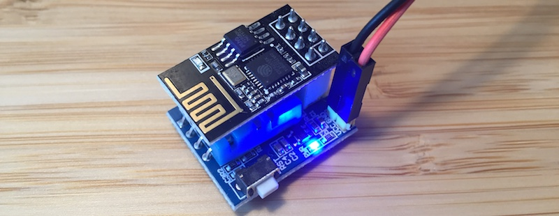
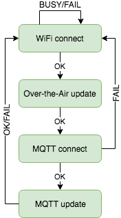

# Internet-of-Things Weather Station (ESP8266, DHT11)

This project is about building and coding an Internet-of-Things "weather station" based on the DHT11 sensor. The device sends data to an MQTT broker from where it can be processed and sent to a display device, logged for statistics, used in a control loop...

The hardware is based on commercial modules and does not need any special assembly tools.

# Bill of materials

| Description                       | Reference                     | Price ($) |
| --------------------------------- | ----------------------------- | ---------:|
| ESP8266-01                        | ESP8266-01                    | 2.50      |
| DHT11 sensor board for ESP8266-01 | ESP8266 DHT11                 | 2.20      |
| Programmer                        | ESP01 Programmer Adapter UART | 1.20      |
| Prototyping cables                |                               | 2.00      |

The board must be supplied between 3.7V and 12V, this has not been included in the bill of materials as it could be powered from a number of different sources on hand (sector, computer USB port, battery, USB charger...).

# Software

The program is a state machine with 4 states:

* Connect to the WiFi network
* Update Over-the-Air
* Connect to MQTT broker
* Publish MQTT messages

## Dependencies

* [`ESP8266 core for Arduino`](https://github.com/esp8266/Arduino)
* [`DHTesp`](https://github.com/beegee-tokyo/DHTesp)
* [`PubSubClient`](https://github.com/knolleary/pubsubclient)

## MQTT messages

The device publishes the following MQTT topics:

* `status`: sensor reading status, `OK` when successful, `TIMEOUT` or `CHECKSUM` when the reading fails
* `temperature`: temperature in degrees Celsius
* `humidity`: humidity in percent
* `heatindex`: human-perceived equivalent temperature in function of temperature and humidity

## Configuration

The following parameters need to be configured in `config.h`:

* WiFi credentials
* MQTT broker server and optionally credentials
* Sensor update rate

# Version

## 2018-01-21

* Initial version

# License

The software is licensed under [GNU General Public License](https://en.wikipedia.org/wiki/GNU_General_Public_License).